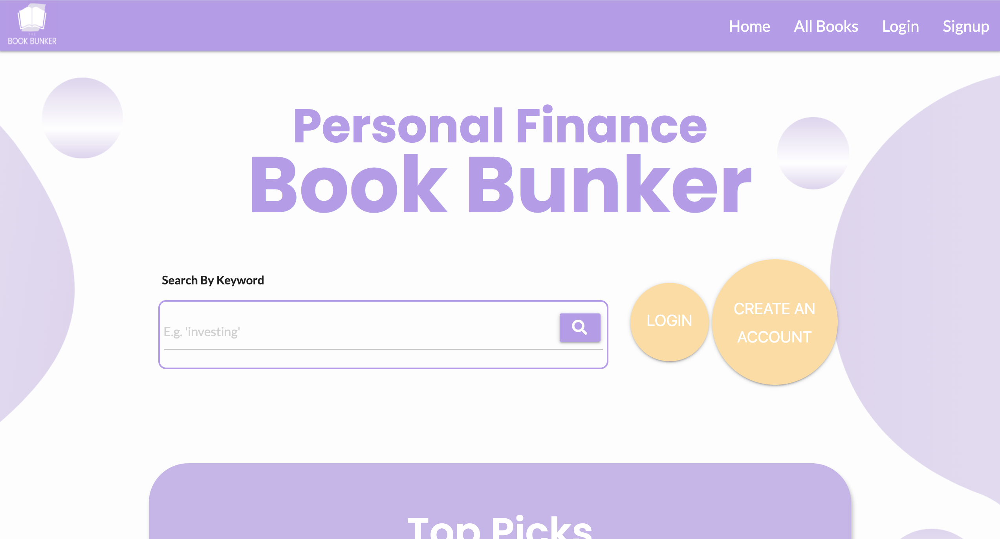
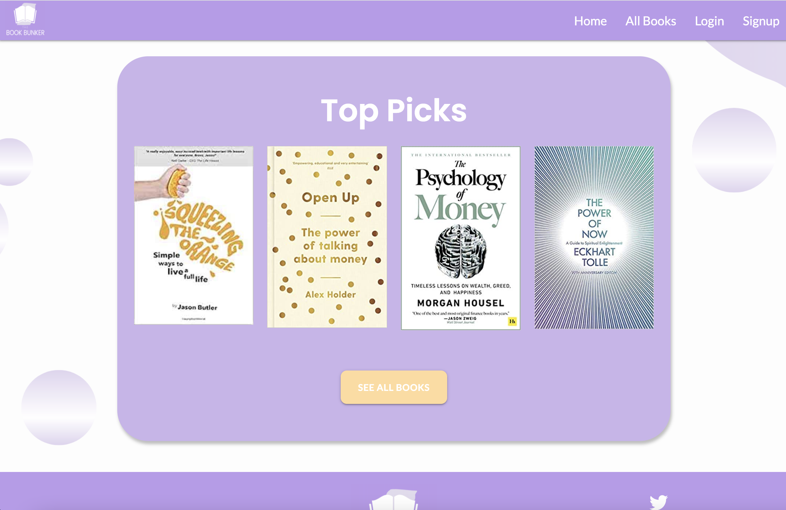

## Table of Contents

1. [UX](#ux)
    * [Primary Goal](#primary-goal)
    * [User Profile](#user-profile)
    * [User Stories](#user-stories)
    * [Design Process](#design-process)
        * [UX Design](#ux-design)
        * [Colours](#colours)
        * [Fonts](#fonts)
    * [Wireframe Mockups](#wireframe-mockups)

2. [Features](#features)
    * [Home](#home)
    * [All Books](#all-books)
    * [Book Display Page](#book-display-page)
    * [Login](#login)
    * [Signup](#signup)
    * [Add Book](#add-book)
    * [My Profile](#my-profile)
    * [User Settings](#user-settings)
    * [Edit Book](#edit-book)
    * [Logout](#logout)
    * [CRUD Functionality](#crud-functionality)
    * [Database Structure](#database-structure)
        * [Structure overview](#structure-overview)
        * [Field Relationships](#field-relationships)
    * [Features to Implement in the Future](#features-to-implement-in-the-future)

3. [Technologies Used](#technologies-used)
    * [Languages](#languages)
    * [Tools](#tools)
    * [Frameworks](#frameworks)
    * [Libraries](#libraries)
    * [Database Management System](#database-management-system)
    * [Graphics](#graphics)

4. [Testing](#testing)

5. [Deployment](#deployment)

6. [Credits](#credits)
    * [Inspiration](#inspiration)
    * [Media](#media)
    * [Code](#code)

## UX

### Primary Goal

The primary goal of this website is to offer a comprehensive directory of personal finance books. For example, a person interested in reading up about investing will not have to trawl through the thousands of books available online, with no way of knowing if a book is useful or enjoyable, but rather can search a database of books recommended by like-minded people. I have observed the finance community on social media and something that always proves popular is book recommendations. Therefore, I thought a searchable space dedicated to this alone would be very useful to lots of people.

### User Profile

**The ideal user of this website is:**

The ideal user of the website is someone who has an amateur interest in personal finance and financial wellbeing. This user wishes to search for books surrounding a particular keyword and build a reading list from this. Through the value that such a website provides, a user might be more inclined to purchase a book through an affiliate link provided on the website or provide their email address to creates an account. Both affliate links and mailing lists great methods for monetization.

**Users of this website are looking to:** 

- Begin educating themselves on personal finance. Or perhaps they already follow several financial education platforms on Instagram, Twitter or YouTube and want to take the next step.
- Improve their relationship with money or their general financial wellbeing.
- Find out what books those those in the financial community recommend.
- Discover a single location to find, read about, save and buy personal finance books.

**This website facilitates this for the user by providing:**

- A search function among trusted suggestions for personal finance books.
- The ability to create an account on the website, allowing users to save books to a personal reading list which they can manage themselves.
- Option to uplaod a book recommendation to the website, as well as edit or delete it at a later date.

### User Stories

1. As a new user, I want to quickly find a book related to a particular topic, for example, 'pensions'.
2. As a new user, I want to read the description of a book to see if I am interested in buying it.
3. As a new or existing user, I want to find a link to buy a book I have decided I want to read.
4. As a new user, I want to create an account containing a personal reading list I have created.
5. As an existing user, I want to view, add and remove books from my reading list.
6. As an existing user, I want add a book recommendation to the website and be able to edit or delete it later on.
10. As the owner of the website, I want to build up a mailing list of people with an interest in personal finance to market my resources, services and platforms to.
11. As the owner of the website, I want to receive a commission from the affiliate links users have used to buy books they have found out about from my website.

### Design Process

**UX Design**

1. Strategy Plane

In my research, I searched for a website that offers a comprehensive and easily searchable collection of personal finance and financial wellbeing books and there were none. The closest match I could find were online articles such as ['17 best personal finance books'](https://www.notion.so/Book-Bunker-README-md-0a1a4c4f2e7948c8a104bb43aa1f4387) and shortlists from companies of their best selling books, such as Amazon's ['Dummy Finance'](https://www.amazon.co.uk/s?k=dummies+finance&i=stripbooks&adgrpid=55820272240&gclid=Cj0KCQiAvbiBBhD-ARIsAGM48bxh3cgKTNy7W1wXEPDBPiZhOH905f6iJ6C8axr1YC0ZOjpwqR8pUyYaAl2EEALw_wcB&hvadid=259077914612&hvdev=c&hvlocphy=9045050&hvnetw=g&hvqmt=b&hvrand=6563007144507394676&hvtargid=kwd-300672784782&hydadcr=18461_1772262&tag=googhydr-21&ref=pd_sl_2o7e0kq9pg_b) range. While useful, these resources do not allow a user to search a specific keyword and return all results relating to it. I decided that a simple, one-stop database would be a time-saving and handy website for lots of people, rather then forcing them to trawl through articles and review sites, an undoubtedly laborious and often confusing task.

2. Scope Plane

Having identified this gap in the online personal finance market, I investigated the scope of creating a website to satisfy it. The primary feature and main attraction of the website would be the ability for a user to input a keyword and instantly access a database of book recommendations relating to it. Therefore, a search bar on the homepage and on the page displaying 'All Books' were important features, as was assigning each book a category.

The secondary features of the website would be to create a more personal experience for the user and encourage them to revisit the website. The benefit of this from a business perspective would be to build a mailing list of people interested in finance and increase the likelihood of the user using an affiliated link on more than one occasion. Therefore, the user needed to have the option to login/signup for an account and have a space where they could save books they have found on the site that they want to read. These would be satisfied by the login/sign page and the reading list found on the 'My Profile' page.

3. Structure Plane

Once I had decided on the features I wanted to include, I moved on to the structure. Out of personal preference, the website would be divided into separate pages, rather than one continuous page. These pages would be 'Home', 'All Books' and 'Login/Signup'. For users who create an account, 'Add Book', 'My Profile' and 'Log Out' (in place of 'Login/Signup') become a navigation option.

4. Skeleton Plane

Having planned out my structure, I created wireframes in Figma (see wireframes). The 'Home' page would be the page the user lands on upon first visiting the site. The purpose of this page would be to fulfil the user's wish to search for books, so the search bar should be the main focus along with call to action login/sign up buttons tot he right hand side when the user is not logged in.

The 'All Books' page would also have a search bar at the top, and return a list of books relating to the keyword the user enters. If they have yet to search for anything, all book in the database display. A user has the ability to click on the book to read more about it and add to their reading list found on 'My Profile'.

The 'Add Book' page, only visible to logged in users, will facilitate the user adding their own book recommendation to the database. All fields are required to do this and they can edit or delete their recommendation at an time from the profile.

The 'My Profile' is a page which is only visible to a logged in user. The user can find books in this area they have bookmarked. These will appear in a collapsible element. Books can be marked as read and removed from the list once read. The user can also manage their own book recommendations added to the website in the collapsible element beneath this, with edit and delete functions. 

The final menu item appears to those who have yet to login or signup as 'Login/Signup' and to those who have logged in as 'Log Out'. There will be a simple form for 'Name' and 'Password', plus an additional 'Email' field for new users if signing up. Prompting buttons such as 'Already have an account?' and 'New here?' help the user navigate to the appropriate page.

5. Surface Plane

I wanted The Book Bunker's visual design to be light, clean and simple. This is important for a user who wants a simple website for getting the information they want quickly or they may exit and find another website. Loud colours and complicated layouts would be counteractive to this. I'm an advocated for rounded edges to all shapes on websites because I think it effortlessly gives a modern and sleek feel.

This project has been imagined with a particular client in mind, who eventually might like to leverage this site as another way of growing their brand awareness. Therefore, my design reflects [their website](https://www.jason-butler.com) style and colour scheme, which is lilac, white, light grey and dark grey. PLEASE NOTE*: I designed, built and currently maintain this website and all company branding associated with it.*

All these visual features and colours I experimented with and decided on in the creation of my wireframes in Figma [see wireframes](#wireframe-mockups).

**Colours**

All pages comprise of these base colours:

-  #BB98EB (lilac)
-  #FFFFFF (white)
-  #DAD9D9 (light grey)
-  #282828 (dark grey)

**Fonts**

The fonts used in this project are "Poppins" for headings and "Lato" for paragraphs from Google fonts. All text has been assigned the generic font "sans serif" should Google fonts fail to load.

Opting for sans serif fonts gives the site a modern and sleek feel. The specific choices from Google fonts are easy to read. The contrast between the bold weight of "Poppins" and the regular weight of "Lato" is a nice pairing to the eye.  

### Wireframe Mockups

My entire Figma workspace for this project can be viewed [here](https://www.figma.com/file/WlJ4F22GdniPyiQmA1At1T/Milestone-3?node-id=0%3A1).

## Features

### Home

The homepage is the landing page for users. The focus is the title of the the website in large font and a search bar accompanied by the prompt 'Search By Keyword'. A placeholder 'E.g. investing' in the input box also helps guide the user as to the sort of word they might search for. Once the user hits enter to search for their keyword, they will be redirected to the 'All Books' page. For users not logged in/signed up, a larger circle with the call to action 'Create An Account' and a smaller call to action 'Login' appear tot he left hand side of the search bar. Once a user is logged in, these do not display and the search bar spans the centre of the page completely.

Below this is a section for 'Top Picks', or featured books as decided by the site owner. Click on a book takes the user to the book's individual page displaying all of its information. A 'See All Books' button also appears below this and takes the user to the 'All Books' page.

### All Books

The All Books page also contains a search bar at the very top of the page. Once a user enters a word and hits enter, the page will only display books matching this search. 

The keyword for the user has search for this indicated in a string at the top of the page just under the search bar. If no results match the search term, a string in the same location indicating this appears. When a user as performed a search, a 'Show All Books' button appears just about the books displayed. When the user clicks this, all books display once again and this button disappears again. 

To the right hand side of the search bar is a yellow button, which when hovered over tells the user than can add their own book recommendations (with a Materialize tooltip). If they user clicks this, they are redirected to the 'Add Book' page. Books display below this in Materialize cards for visual uniformity. The image, title, author, year and category are displayed and access to more information on the book is indicated by an ellipsis icon. Click on the book takes the user to an individual book page for that particular book and provides the user with more information.

### Book Display Page

Individual book pages contain the title and author of the book in the heading of the page. Below this is the book description to the left hand side and the book image to the right hand side. The user who added the book is displayed below the description and below this are 'Buy Now' and 'Bookmark' buttons. If the session user matches the user who added the book, options to edit and delete the book also appear. A 'Back to All Books' button in the top left hand corner of the page returns the user to the 'All Books' page.

### Login

The Login page provides the user with two fields to fill out to log in to their account: username and password. There is a flashing button in the top right-hand corner which allows the user to switch to the signup page if they have not created an account yet.

### Signup

The Signup page provides new users with a form to create an account with the fields username, password and email. A message appears to advise the user to choose another username if the one they enter already exists in the database. There is a flashing button in the top right-hand corner which takes the user to the login page if they already have an account.

### Add Book

The 'Add Book' page is only visible to a user who is logged in since the site does not want to allow anyone to add books to the database with providing a username and email address. A simple form containing the following fields is displayed for the user to add a book: title, author, category (dropdown), year (limited to between 2021 and 1980), description, image URL and purchase URL. All fields are set to required and the session user's username will be associated with the book upon submit. The 'Add Book' button at the bottom of the form adds the book to the 'Books' collection in the database. The user is then redirected to the All Books page.

### My Profile

The 'My Profile' page is only visible to logged in users. The user's username is displayed at the top of the page and underneath this are two collapsible elements. The first is a reading list. Books the user has bookmarked appear here. The title and author appear in the head element and the book description and purchase link appear in the collapsing body element. A complete button appears in yellow on the right hand side of the book title, which allows the user to remove the book from their reading list. 

Below the reading list is a list of books which the logged in user has added to the database. The same details are displayed as in the reading list, but the user has the option to edit or delete the book. The delete button triggers the warning dropdown to the user that the deletion is permanent for all users and asks that they confirm this action or cancel.

If a user has neither bookmarked any books nor added any books to the site, buttons encouraging them to do so appear in each section.

### User Settings

In the top right-hand corner of the My Profile page is a floating action button for access to user settings. Hovering over it triggers the display of two settings controls: Edit User and Delete User.

- Edit User takes the user to a page where they can edit their username, password or email.

- Delete User  takes the user to a confirmation page that they do want to delete their profile. There is a button which can return them to their profile below the confirmation message.

### Edit Book

The 'Edit Book' page presents the same form as on the 'Add Book' page, however the form is pre-filled with the current values. The user can then enter changes and once clicking 'Edit Book' button, the book is updated in the books collection database. 

### Log Out

The 'Log Out' page displays the name of the user who is currently logged in. The 'Log Out' button below this will remove this user from the current session and return the user to the "Login' page. Below this button is another button which takes the user to their profile page if clicked. 

The website is fully responsive on all screen sizes, with all text sizes and block dimensions adjusting appropriately.

### CRUD Functionality

- **Create** functionality of the website is fulfilled by several areas. Secondly, a user can add a book for the website as a recommendation on the "Add Book' page. Thirdly, a user can create a library of bookmarked (saved) books which they can view at any time on their profile
- **Read** functionality is provided by the website in several ways. Users are able to search the site for book and learn about titles, authors and book descriptions. They can access external links to buy a book and they can see what user has recommended a certain book.
- **Update** functionality is fulfilled by the 'Edit Book' page, accessible using the edit buttons next to a book if a user is logged in and responsible for the recommendation of the book. All fields associated with the book can be changed and updated in the database by the user.
- **Delete** functionality is provided by the delete buttons located next to a book if a user is logged in and responsible for the recommendation of the book. After the user has confirmed the action, the book is entirely deleted from the books collection in the database.

### Interactive Features

This project uses JQuery to implement interactive features using Javascript. This includes:

- Materialize interactive features including the collapsible elements, tooltips, mobile navbar, form select and floating action buttons.
- The addition and removal of the 'Show All Books Button' from the 'All Books' page depending on if all books or those matching a certain criterion are being shown.
- The Back To Top button on the All Books page uses Javascript to display only when a user scrolls below a certain screen height and disappear when either activated or the user scrolls above a certain screen height.

### Database Structure

This project uses MongoDB to host its document-based database. The use of a non-relational database was most suited to this project. Nesting data in a single data structure was an effective and easy way to manage and display it. Below is a visual representation of how the database is structured.

#### Structure Overview

This project's database, book_bunker comprises of three collections: books, categories and users.

- The books collection contains information about each book that is added to the site. These seven fields in each document are: ObjectId _ _id_, title, author, category, year, image_url, description, purchase_link, add_by. image_url. image_url and purchase_link are optional fields for the user to fill out, so may have the value fo an empty string.

- The categories collection contains each personal fiannce category available for a user to assign to a book. The two fields each document contains are: ObjectId _ _id_ and category_name.

- The users collection contains all information about each user that creates an account on the website. The five fields in each document are: ObjectId _ _id_, username, password, email, bookmarked. The bookmarked field is an array that holds the ObjectId _ _id_ of each book they have choosen to save to their profile.

#### Field Relationships

There is a relationship between several fields across all of the collections.

- The ObjectId _ _id_ value in each document in the books collection may be stored in the bookmarked array field of any document in the user collection.

- The category value in each document in the books collection matches the category_name value of one document in the categories collection.

- The added_by value in each document in the books collection matches the username value of one document in the users collection.

### Features to Implement in the Future

- I would like to add a 'like' option to the website in the future. If a user likes a book that has already been added as a recommendation, they can affirm this by hitting a heart icon displayed next to the bookmark icon below each book. A tally of how many people have clicked like will appear next to the icon. This would be a useful way for users to gauge the popularity of a book among many users not just the user who has recommended. This feature could even be used to upvote a book and render those with the highest number fo likes at the top of the 'All Books' page and those with the lowest at the bottom.
- I would like to implement a feature which allows logged in users to leave a comment below a book on each individual display page of a book. This would create a more engaging community and allow users to interact with each other and discuss different books.

Time limitations meant that these features were not able to be implemented in this version of the website but they are things I am excited to introduce soon.

## Technologies Used

### Languages

- HTML - base language for this project.
- CSS - used for styling the HTML code.
- JavaScript - used to make the website interactive.
- **[Python3](https://www.python.org/download/releases/3.0/)** - used to build the backend of this project.
- **[Jinja](https://jinja.palletsprojects.com/en/2.11.x/)** - this prject uses the templating language Jinja for referencing Python in the frontend.

### Tools
- [**Gitpod**](https://www.gitpod.io/) - the IDE Gitpod was used in the building process of this website.
- [**HTML Validation**](https://validator.w3.org/) - HTML was validated using W3C Validator.
- [**CSS Validation**](https://jigsaw.w3.org/css-validator/) - CSS was validated using W3C CSS Validator.
- [**JSHint**](https://jshint.com/) - Javascript was validated using JSHint.
- Python validator
- [**Free Formatter**](https://www.freeformatter.com/) - Free Formatter was used to format all HTML, CSS and Javascript files.
- [**Google Chrome DevTools**](https://developers.google.com/web/tools/chrome-devtools) - DevTools were used to debug and test code in the browser.

### Frameworks
- **[Flask](https://flask.palletsprojects.com/en/1.1.x/)** - this project uses the Flask framework for its Python backend programming.

### Libraries
- **[Materialize](https://www.materializecss.com/)** - this project uses Materialize to optimise its layout and structure.
- **[FontAwesome](https://fontawesome.com/)** - this project uses FontAwesome 5 to provide icons.
- **[Google Fonts](https://fonts.google.com/)** - this project uses Google Fonts to style the website's fonts.

### Database Management System

- **[MongoDB](https://www.mongodb.com/3)** - this project hosts its database on the document-based DBMS MongoDB.

### Graphics

- **[Figma](https://www.figma.com/)** - this project used Figma to construct wireframes in the design stage of the website.
- **[Canva](https://www.canva.com/)** - this project used Canva to make all graphics.

## Testing

Testing information can be found in this [TESTING.md file](TESTING.md).

## Deployment

This project was created in the IDE Gitpod and Github as remote repository. The deployed project on Heroku can be viewed [here](https://personal-finance-book-bunker.herokuapp.com/).

### Deployment to Heroku

To deploy to Heroku, I took the following steps:

1. In the terminal of Gitpod, I created a `requirements.txt` file to store all of the project's dependancies in using the command `pip3 freeze > requirements.txt` in the terminal window.
2. Then I created a Procfile to specify the commands that are executed by the app on startup using the command `echo web: python app.py > Procfile` in the terminal window.
3. Having used the `git add` and `git commit` commands on these changes, I pushed them to the Github repository for the project with the command `git push`.
4. In my Heroku account, to create a new app for the project, I clicked the 'New'button within my dashboard, assigned it the name 'personal-finance-book-bunker' and selected Europe as my region.
5. Once Heroku had created my new app, from my dashbaord I clicked "Deploy" and then "Deployment Method" within this page. I connected the Heroku app to my GitHub repository "book-bunker-ms3" and set deployments from the master branch to automatic.
6. Following this, to set my config vars for the app, I went to "Settings" tab in the app dashboard and clicked "Reveal Config Vars". The config vars were set as follows:

7. Back in Gitpod, to add the Heroku app as a remote repository, I used the command `git remote add heroku` followedby the Heroku git url `https://git.heroku.com/personal-finance-book-bunker.git`.
8. To push the project code to Heroku, I used the command `git push -u heroku master
9. This completed the process of deploying the project to Heroku. Once deployed, I continued to push all changes made to the project to Heroku using the commands `git add`, `git commit` and `git push`.

### How to run this project locally

## Credits

### Inspiration
- This project was inspired by the brand identity of [jason-butler.com](https://www.jasoon-butler.com/) for potential monetization in the future by Jason.
- This project also received inspiration from the financial education community on [Instagram](https://www.instagram/com) by recognising the importance of personal finance book recommendations to its members.

### Media
- All background images were created for this project in Canva.

### Code
- This project makes use of many Materialize features provided in its documentation and was modified for this website's specific requirements.
- The #back-to-top button was modelled off of the code found at [here](https://codepen.io/deveb22/pen/QxPmGz).
